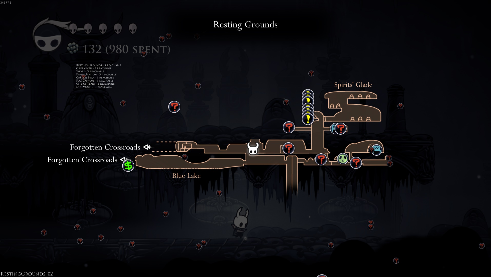

# Randomizer Map

This is a mod for Hollow Knight Randomizer that adds pins to the map showing
the location of the various checks. It's training wheels for beginners to
learn how to play Hollow Knight Randomizer.

## Features

* Talking to Elderbug 3 times activates the mod and gives you all maps
  (including the Collector's Map if grubs are non-randomized) and the compass
  charm.
* Alternatively, `Ctrl + M` will give you all the maps, `Ctrl + G` will toggle
  the Collector's Map, and `Crtl + P` will hide/show the Rando pins.
* The map will contain pins indicating which checks are currently reachable.
* The map will show a list of areas and the number of checks available in each
  area.

## How to install

1. Make sure `ModCommon.dll` and `RandomizerMod3.0.dll` are already installed
   in your Hollow Knight Mod Folder. If they're not installed, easiest way to
   install them is to [use the Hollow Knight Mod Installer](https://www.nexusmods.com/hollowknight/mods/9).
2. Download [the latest release of `RandoMapMod.dll`](https://github.com/CaptainDapper/HollowKnight.RandoMapMod/releases/).
3. Copy `RandoMapMod.dll` to your Hollow Knight mod folder (for example
   `C:\Program Files (x86)\Steam\steamapps\common\Hollow Knight\hollow_knight_Data\Managed\Mods`).
4. Start a new game.
5. Talk to Elderbug 3 times.

## How it works

There are five different types of pins:

* **Small Dark (?) Pins** indicate item locations that are considered to be not
  reachable based on the allowed-skip settings in the randomizer. It's possible
  they are still obtainable through sequence breaks.
* **Big Red (?) Pins** indicate item locations that are currently considered
  reachable, and one of these will contain the progression you are looking for
  if you are stuck.
* **Yellow (!) Pins** indicate item locations that are currently considered
  reachable but still require some form of prerequisite to obtain. For example,
  Grubs for Grubfather or Essence for Seer.
* **Small Dark ($) Pins** indicate shop locations that are currently considered
  not reacehable.
* **Big Green ($) Pins** indicate shop locations that are currently in
  reachable, as a reminder to the player that the shop may still have items for
  sale they may need.

## Thanks!

* seanpr96 for the original version of the randomizer.
* homothetyhk for version 3 of the randomizer.
* CallumMosely for the multiworld version of the randomizer.
* CaptainDapper for the original version of the RandoMapMod.
* TheGreatGallus for updating RandoMapMod to work with v3 of the randomizer.
* NebuPookins for the Collector's Map and Reachable Count features.

## Version History

* v0.3.2
  * First "official" release. Fixed the map boundaries so the map ACTUALLY
    scrolls to the edges without having to purchase every map first.
* v0.3.5
  * Compatibility for Rando 3
* v0.3.8
  * Fixed the location of various pins (Monarch Wing, ShadeCloak, Isma's Tear,
    etc. see https://github.com/TheGreatGallus/HollowKnight.RandoMapMod/commit/4fde875a9daf92d1b6e8519aa11e9f362b7c32b7
    for the full list).
  * Talking to Elderbug now causes Cornifer to immediately go home and sleep.
* v0.4.0
  * Elderbug now also gives Collector's Map, indicating the location of the
    grubs, if grubs are not randomized.
* v0.5.0
  * There is now an overlay on the map that shows how many reachable checks
    there are in each location.
* v0.5.1
  * Added the ability to unlock the maps with hotkeys.
  * Refactored everything (whoops).